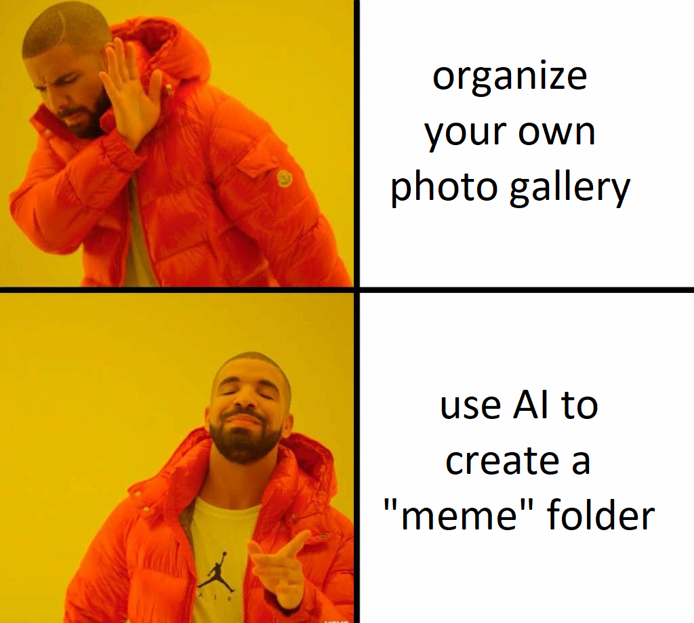

# Image Classification Project: Memes vs. Photos

Welcome to the Image Classification project designed to distinguish between memes and ordinary photos. This project relies on a machine learning model trained to identify and classify these two types of images.

## Context

The objective of this project is to create a machine learning model capable of differentiating humorous memes from non-humorous photos. The datasets used for this project were obtained from Kaggle, where we collected two distinct datasets:
- A database containing random photos.
- Another database containing exclusively memes.
